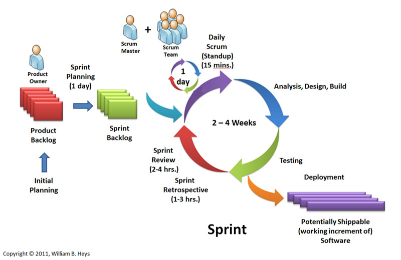

# Que es un tableto Kanban

Es un simbolo visual que se ultiliza para desencadenar una accion, a menudo se representa en un tablero Kanban para reflejar los procesos de su trabajo, el Kanban se movera a travez de las diversas etapas de su trabajo hasta su finalizacion. Se considera un metodo de extraccion.

Tambien se le denomina sistema de tarjetas pues en su implementacion mas sencilla ultiliza tarjetas que se pegan en los contenedores de material y que se despegan cuando estos contenedores son ultilizados, las tarjetas actuan de testigo del proceso de produccion.

---
### Como Funciona

###### Existe una serie de principios básicos con el fin de obtener el máximo rendimiento de su flujo de trabajo

__*Visualice lo que hace (su flujo de trabajo)*__: una visualización de todas sus tareas y elementos en una tabla contribuirá a que todos los miembros de su equipo se mantengan al corriente con su trabajo.

__*Limite la cantidad de Trabajo en Proceso (límites del TEP)*__: establezca metas factibles. Mantenga el equilibrio de su flujo de trabajo mediante la limitación de los trabajos en proceso para prevenir el exceso de compromiso en la cantidad de tareas que será incapaz de terminar.

__*Realice un seguimiento de su tiempo*__: El seguimiento del tiempo confluye con la metodologia Kanban. Realice un seguimiento de su tiempo de forma contínua y evalúe su trabajo con precisión.

__*Lectura fácil de indicadores visuales*__: conozca lo que está ocurriendo de un solo vistazo. Utilice tarjetas de colores para distinguir los Tipos de trabajo, Prioridades, Etiquetas, Fechas límite y más.

__*Identifique los cuellos de botella y elimine lo que resulta descartable*__: aproveche al máximo los plazos y ciclos de ejecución, del Flujo Acumulativo y de los informes de tiempo. Estos criterios le permitirán evaluar su rendimiento, detectar los problemas y ajustar el flujo de trabajo en consecuencia.

---
### Sprint

El __*Sprint*__ es la unidad básica de trabajo para un equipo Scrum. Esta es la
característica principal marca la diferencia entre Scrum y otros modelos para el
 desarrollo ágil. Es una simple iteración llevada a cabo por los miembros del equipo. Un equipo puede completar varios sprints durante el desarrollo del proyecto.

Un __*Sprint*__ inicia con un equipo que se compromete a realizar el trabajo y
finaliza con la demostración de un entregable. El tiempo mínimo para un Sprint
es de una semana y el máximo es de 4 semanas.

Dentro del desarrollo de un Sprint se llevan a cabo ciertos eventos, estos reciben
 el nombre de Scrum Events o Eventos Scrum. Estos son:

- *Planeamiento del Sprint/Sprint Planning*

Todos los involucrados en el equipo se reúnen para planificar el Sprint.
Durante este evento se decide qué requerimientos o tareas se le asignará a cada
uno de los elementos del equipo.
- *Reunion de Equipo de Scrum/Scrum team meeting*

Estas reuniones se deben realizar diariamente con un máximo de 15 minutos. Siempre en el mismo horario y lugar. En ellas, cada miembro del equipo deberá responder tres simples preguntas:

    ¿Qué hiciste ayer?
    ¿Qué tienes planeado hacer hoy?
    ¿Qué obstáculos encontraste en el camino?

Estas reuniones sirven para que todos los miembros del equipo se apoyen entre ellos.

- *Refinamiento del Backlog/Backlog Refinement*

El Product Owner revisa cada uno de los elementos dentro del Product Backlog con el fin de esclarecer cualquier duda que pueda surgir por parte del equipo de desarrolladores. También sirve para volver a estimar el tiempo y esfuerzo dedicado a cada uno de los requerimientos.
- *Revisión del Sprint/Sprint Review*

Los miembros del equipo y los clientes se reúnen para mostrar el trabajo de desarrollo de software que se ha completado. Se hace una demostración de todos los requerimientos finalizados dentro del Sprint.

En este punto no es necesario que todos los miembros del equipo hablen. Pueden estar presentes pero la presentación está a cargo del Scrum Master y el Product Owner.
- *Retrospectiva del Sprint/Retrospective*

En este evento, el Product Owner se reúne con todo su equipo de trabajo y su Scrum Master para hablar sobre lo ocurrido durante el Sprint. Los puntos principales a tratar en esta reunión son:

    Qué se hizo mal durante el Sprint para poder mejorar el próximo
    Qué se hizo bien para seguir en la misma senda del éxito
    Qué inconvenientes se encontraron y no permitieron poder avanzar como se tenía planificado

---
# Explicacion breve

### Sprint

- Organiza el trabajo en partes pequeñas y concretas.
- Optimiza el proceso en cada iteración.
- Durante el Sprint no debe haber cambios de nada.
- Se caracteriza por la velocidad de los procesos.
- Reuniones diarias hace mas eficaz al equipo.

### Kanban

- Visualiza el flujo de trabajo.
- Limita el trabajo en progreso por fases.
- No hay roles.
- En Kanban cada item en la lista de cosas pendientes no se te indica que debe ser de menor duración al tiempo del Sprint.
- Poca comunicacion entre los miembros del equipo.
