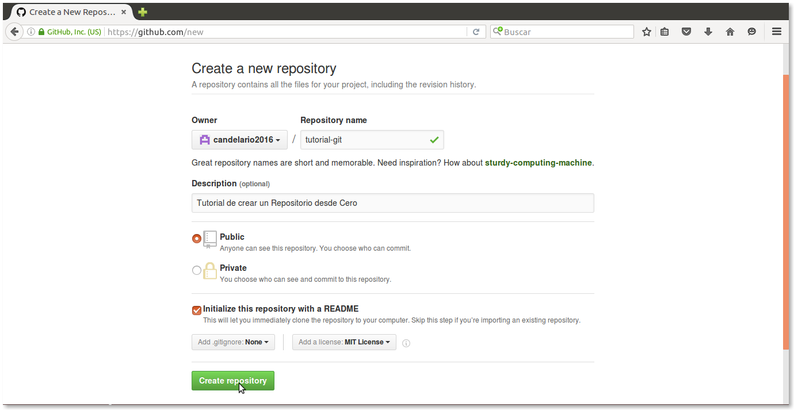

# Tutorial Básico GIT

## Creando un repositorio

Para crear un repositorio nuevo hay dos formas de hacerlo :

1. Podemos iniciar el repositorio de manera local con el comando `git init`.

2. Podemos crear el repositorio de manera remota y luego lo clonamos a nuestro disco duro.

En esta guia vamos a realizar las dos formas de crear un repositorio nuevo....

#### Creando un repositorio de manera local
Lo primero que vamos hacer es abrir nuestra terminal.

Lo siguiente es crear un nuevo directorio,en este caso lo crearemos en el escritorio,
entonces es escribimos la siguinete linea`cd Escritorio` lo cual nos cambia al
directorio de Escritorio, este directorio sera la raíz de nuestro repositorio.El **GIT** se puede trabajar  desde la consola de comandos, crearemos todo desde ahí.

- Para crear el directorio raíz en sistemas unix se ultiliza el comando `mkdir` seguido del nombre del directorio.

Ultilizamos el comando `mkdir`(Make directory) para crear un directorio llamado *creando-respositorio*, despues usamos el comando `ls`(List), para verificar que el directorio haya sido creado y seguido del comando `cd`(change directory) para situarnos en el mismo.

- Luego de ubicarnos en el directorio raíz de nuestro repositorio lanzamos el comando `git init` lo que inicializara un nuevo repositorio vacio de git.

#### Creando un repositorio de manera remota

Lo primero que vamos hacer es crear una cuenta en https://github.com/

Teniendo nuestra cuenta de `github` el siguiente paso es dar click en el signo `+`
que se encuentra ubicado en la parte superior izquierda, dar click `New repository` para crear
un nuevo repositorio.

Ahora que le dimos click en `New repository` nos manda a una ventana en la cual nos solicita rellenar algunos datos muy importante para nuestro repositorio a como esta en la imagen.

Como primer dato vamos a colocar el nombre de nuestro repositorio en `Repository name`.

El siguiente dato que vamos a rellenar es `Description` escribimos una breve descripcion de nuestro respositorio.

Posteriormente Selecionamos la opcion `Public`, y marcamos la opcion ` Initialize this repository with a README ` para que nos genere el documento README y selecionamos la licencia (licenses), para esto desplegamos la opciones y selecionamos la licencia gratuita `MIT License`

Lo siguiente es darle click `Create repository` para finalizar el proceso de crear un repositorio en Github.

Una vez que hemos creado nuestro repositorio, nos mandara al repositorio creado, lo siguiente que vamos hacer es clonar nuestro repositorio a nuestro entorno local, esto lo haremo copiando la URL la cual nos lo brinda nuestro repositorio al dar click `Clone o download` lo cual nos permite descargar de manera comprimido o clonarlo.

Una vez que copiamos el URL de nuestro repositorio que esta de manera remota, abrimos nuestra terminal.

