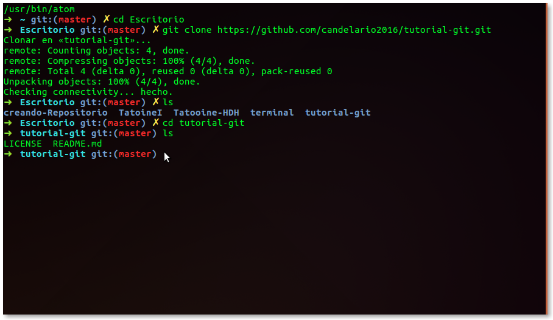
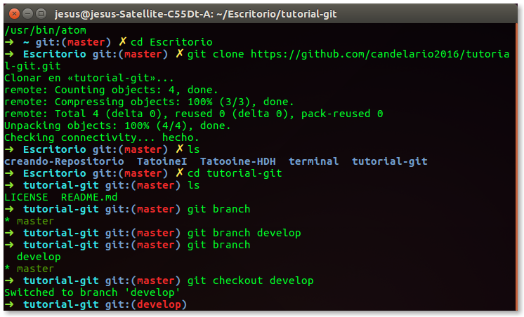

# Tutorial Básico GIT

## Creando un repositorio

Para crear un repositorio hay dos formas de hacerlo :

1. Podemos iniciar el repositorio de manera local con el comando `git init`.

2. Podemos crear el repositorio de manera remota y luego lo clonamos a nuestro disco duro.

En esta guia vamos a realizar las dos formas de crear un repositorio....

#### Creando un repositorio de manera local
Lo primero que vamos hacer es abrir nuestra terminal.

Lo siguiente es crear un nuevo directorio,en este caso lo crearemos en el escritorio,
entonces es escribimos la siguinete linea`cd Escritorio` lo cual nos cambia al
directorio de Escritorio, este directorio sera la raíz de nuestro repositorio.El **GIT** se puede trabajar  desde la consola de comandos, crearemos todo desde ahí.

- Para crear el directorio raíz en sistemas unix se ultiliza el comando `mkdir` seguido del nombre del directorio.

Ultilizamos el comando `mkdir`(Make directory) para crear un directorio llamado *creando-respositorio*, despues usamos el comando `ls`(List), para verificar que el directorio haya sido creado y seguido del comando `cd`(change directory) para situarnos en el mismo.

- Luego de ubicarnos en el directorio raíz de nuestro repositorio lanzamos el comando `git init` lo que inicializara un nuevo repositorio vacio de git.

#### Creando un repositorio de manera remota

Lo primero que vamos hacer es crear una cuenta en https://github.com/

Teniendo nuestra cuenta de "github" el siguiente paso es dar click en el signo "+"
que se encuentra ubicado en la parte superior izquierda, dar click "New repository" para crear
un repositorio.

Ahora que le dimos click en "New repository" nos manda a una ventana en la cual nos solicita rellenar algunos datos muy importante para nuestro repositorio a como esta en la imagen.

Como primer dato vamos a colocar el nombre de nuestro repositorio en "Repository name".

El siguiente dato que vamos a rellenar es "Description" escribimos una breve descripcion de nuestro respositorio.

Posteriormente Selecionamos la opcion "Public", y marcamos la opcion " Initialize this repository with a README "  para que nos genere el documento README y selecionamos la licencia (licenses), para esto desplegamos la opciones y selecionamos la licencia gratuita  "MIT License"

Lo siguiente es darle click  "Create repository" para finalizar el proceso de crear un repositorio en Github.

Una vez que hemos creado nuestro repositorio, nos mandara al repositorio creado, lo siguiente que vamos hacer es clonar nuestro repositorio a nuestro entorno local, esto lo haremo copiando la URL la cual nos lo brinda nuestro repositorio al dar click " Clone o download " lo cual nos permite descargar de manera comprimido o clonarlo.

Una vez que copiamos el URL de nuestro repositorio que esta de manera remota, abrimos nuestra terminal.

Ingresamos cd Escritorio  (La razon para ubicarnos en la direcion del escritorio esta opcion es al gusto de cada quien) y escribimos en la terminal el comando `git clone` direcion del URL.

Por lo tanto quedaria:

Una vez que le damos al comando nos despliega la siguiente informacion la cual nos da una descripcion de los objetos creados o proyecto creado de manera remota local.

Ejecutamos el comando `ls` para validar que nuestro reposito local se haya creado.....

Como observamos se ha creado un directorio con el nombre de nuestro repositorio, lo cual nos indica que lo hemos realizado de manera correcta.

Ingresamo el comando `cd` nombre_repositorio

Por consiguiente nos queda:

Ejecutamos el comando `ls` para visualizar que documentos se han creado, como observamos se ha creado el LICENSE y README.md , lo cuales le indicamos al momento de crear el repositorio.

Ahora vamos adentrarnos mas al mundo de git, vamos ejecutar el comando `git branch`, lo cual nos permite ver las ramas existente de nuestro repositorio.

Como se observa aparece unicamente el nombre de : *master* .Este es el nombre de nuestra rama principal, por lo tanto vamos a crear otra rama en la cual se la parte intermendia de nuestro proyecto con el fin, de alojar unicamente en nuestra rama principal los proyecto estables.

Lo siguiente es crear un rama intermendia la cual trabajaremos , para crear una rama nueva ejecutamos el comando `git branch` nombre_de_la_rama_nueva.
Por lo tanto quedara de la siguiente manera `git branch develop`

Ejecutamos el comando `git branch ` para validar que se ha creado la rama develop.

Lo siguiente que vamos hacer es ejecutar el comando `git checkout` nombre_rama_a_ultilizar.

Nos mostrara un mensaje que hemos realizado un cambio de rama. Por lo tanto nos podremos dar cuenta que la leyenda dice ** tutorial-git git: (develop)**

Ahora que nos encontramos en la rama develop vamos a crear otra rama nueva, en la cual vamos a trabajar el proyecto o cambios a realizar de un proyecto, es recomendable para no afectar el proyecto base...

Vamo a Limpiar nuestra termina con el comando `clear` para trabajar de manera ordenada y despues ejecutamos el comando `git checkout -b add-prueba-repositorio`, este comando nos permite agregar una nueva rama y cambiar a la rama creada.

Esto es equivalente a ejecutar el comando que vimos anteriormente:

1.- `git branch add-prueba-repositorio`

2.- `git checkout add-prueba-repositorio`

Ejecutamos el comando `git branch` para visualizar nuestras ramas, si observamos tenemos 3 ramas, vamos a trabajar en estos momentos con la rama **add-prueba-repositorio**, en la que ya nos encontramos posicionado.

Ahora vamos hacer una modificacion o agregar una informacion a nuestro README para ver el flujo de trabajo de git. Una vez que hayas modificado el documento ejecutamos el comando `git status` el nos permite ver si hay modificaciones.

Como se logra apreciar manda informacion para darnos indicacion de agregar los cambios con el comando `git add <archivo>` y despues ejecutar el comando `git commit` ,al igual nos informa cual es el archivo modificado lo cual no los marco de color rojo con el nombre.

Vamos agregar los cambios en nuestra rama con el comando `git add README.md`

Lo siguiente es ejecutar el comando `git commit -m`
"comentario"

El cual nos indica que se ha agregado los cambios del documento.

Ahora para visualizar los cambios en nuestro repositorio Github.
Ejecutamos el comando `git push origin`
 nombre_rama_a_ultilizar

Damos click en la opcion que dice Compare y pull request

 Nos manda a la venta Open a pull request observamos que aparece la descripcion del commit escrito anteriormente

En la parte inferior nos podemos dar cuenta que aparecen la difencia de los cambios realizado en nuestro repositorio

Si observamos unicamente nos aparece que le podemos hacer pull al master, esto debido que no hemos hecho un push a develop para que aparesca. La razon por la que no aparece develop es porque esta vacio por lo tanto vamos a realizar un `push origin` a develop.

Antes de realizar un push origin a develop vamos primero a cambiar de rama con el comando `git checkout develop` y depuest ejecutaremos el comando `git push origin develop`

Regresamos a Github y presionamos la tecla **F5** para actualizar y desplegamos el menu base y si nos damos cuenta ahora si aparece la opcion develop para realizar el pull con develop

Realizamos click en la opcion Create pull Request , cambiar la opcion "**base:develop**" y "**compare:add-prueba-repositorio**", fijarse mucho en que estamos haciendo el pull a la rama correcta

Confirmamos

Eliminamos

Finalmente podemos visualizar el trabajao realizado en nuestra rama develop

